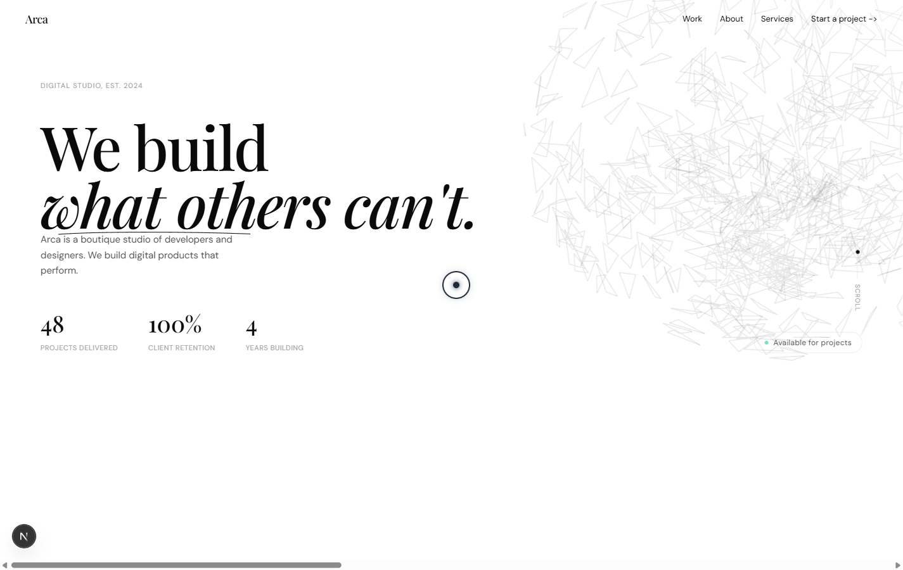

# Arca Studio — Agency Site (Project 02)

**Arca Studio** is a premium agency portfolio showcasing cutting-edge web design and development work. Featuring WebGL animations, interactive browser mockups, and a polished case study presentation.



## Overview

Arca Studio demonstrates advanced web technologies and agency best practices:
- **WebGL Hero** — Interactive 3D wireframe mesh background
- **Project Showcase** — Case studies with interactive browser mockups
- **Services Section** — Detailed service offerings and expertise
- **Team & Social Proof** — Team highlights and client testimonials
- **Contact Section** — Lead capture and inquiry form

## Tech Stack

- **Framework**: Next.js 16 (App Router)
- **Styling**: Tailwind CSS 3
- **Animation**: Framer Motion + GSAP
- **3D Graphics**: Three.js (WebGL)
- **UI Components**: `@agency/shared` component library
- **Typography**: Geist font (Vercel)
- **Forms**: React Hook Form + Zod validation

## Quick Start

### Prerequisites
- Node 18+
- pnpm 10.x

### Installation & Development

```bash
# Install dependencies
pnpm install

# Start dev server
pnpm dev
```

Open [http://localhost:3000](http://localhost:3000) to view the site.

### Production Build

```bash
pnpm build
pnpm start
```

## Project Structure

```
src/
├── app/
│   ├── page.tsx          # Landing page
│   ├── layout.tsx        # Root layout
│   ├── work/            # Portfolio/case study pages
│   └── globals.css      # Global styles
└── components/
    ├── sections/        # Hero, Projects, Services, Team
    ├── ui/             # Reusable UI components
    ├── webgl/          # Three.js WebGL components
    └── layout/         # Header, Footer, Navigation
```

## Key Features

### 1. **WebGL & 3D Graphics**
- Interactive 3D wireframe mesh in hero section
- Canvas-based animations powered by Three.js
- GPU-accelerated rendering for smooth 60fps performance

### 2. **Interactive Browser Mockups**
- Custom React components simulating browser windows
- Displays project screenshots in context
- Responsive design showcasing across device sizes

### 3. **Case Study Pages**
- Individual pages for each portfolio project
- Rich media galleries and video embeds
- Detailed project context and results

### 4. **Performance Optimized**
- Image lazy-loading and Next.js Image optimization
- Code-splitting and dynamic imports for WebGL
- Reduced motion support for accessibility

### 5. **SEO & Accessibility**
- Semantic HTML structure
- Meta tags, Open Graph, and JSON-LD structured data
- ARIA labels and keyboard navigation

## Customization Guide

### Colors & Branding
1. Update `tailwind.config.ts` for primary colors
2. Modify WebGL material colors in `src/components/webgl/WireframeMesh.tsx`
3. Update logo and branding assets in `public/`

### Content
- **Hero copy**: `src/components/sections/Hero.tsx`
- **Projects**: `src/components/sections/ProjectShowcase.tsx`
- **Services**: `src/components/sections/Services.tsx`
- **Team**: `src/components/sections/Team.tsx`

### WebGL Scene
Edit `src/components/webgl/WireframeMesh.tsx` to:
- Adjust mesh complexity and geometry
- Change material colors and lighting
- Modify animation speed and rotation

### Forms
Lead capture form uses `react-hook-form` + `zod`:
- Validation schema: `src/lib/schemas/contact.ts`
- Form component: `src/components/sections/Contact.tsx`

## Dependencies

Key packages:
- `next`: 16.2.x — React framework
- `react`: 19.x — UI library
- `three`: ^r128.x — WebGL/3D graphics
- `framer-motion`: ^11.x — Animation library
- `@agency/shared`: Monorepo shared components
- `react-hook-form`: ^7.x — Form management
- `zod`: ^3.x — Schema validation

## Deployment

### Vercel (Recommended)
```bash
vercel deploy
```

### Other Platforms
The WebGL components require JavaScript and modern browser support.

Build and deploy:
```bash
pnpm build
# Deploy the `.next` folder
```

## Performance Tips

1. **WebGL rendering** is resource-intensive on mobile. Consider:
   - Disabling WebGL on smaller viewports
   - Using static background fallback
   - Adding performance monitoring

2. **Image optimization**:
   - Use Next.js Image component for all images
   - Serve multiple sizes via `srcSet`
   - WebP format for modern browsers

3. **Animation tuning**:
   - Respect `prefers-reduced-motion` media query
   - Debounce scroll/resize events
   - Profile with Chrome DevTools

## Notes

- **Workspace Dependency**: Consumes `@agency/shared` from the monorepo. To use standalone:
  - Publish `@agency/shared` to npm, or
  - Link packages locally via `pnpm link`
- **Browser Support**: WebGL requires modern browser (Chrome, Firefox, Safari 15+, Edge)
- **See Also**: Check `DESIGN.md` for design system and component API documentation

## License

MIT — Premium template available for commercial projects.

## Learn More

To learn more about Next.js, take a look at the following resources:

- [Next.js Documentation](https://nextjs.org/docs) - learn about Next.js features and API.
- [Learn Next.js](https://nextjs.org/learn) - an interactive Next.js tutorial.

You can check out [the Next.js GitHub repository](https://github.com/vercel/next.js) - your feedback and contributions are welcome!

## Deploy on Vercel

The easiest way to deploy your Next.js app is to use the [Vercel Platform](https://vercel.com/new?utm_medium=default-template&filter=next.js&utm_source=create-next-app&utm_campaign=create-next-app-readme) from the creators of Next.js.

Check out our [Next.js deployment documentation](https://nextjs.org/docs/app/building-your-application/deploying) for more details.
